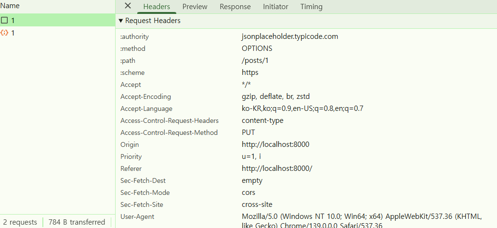
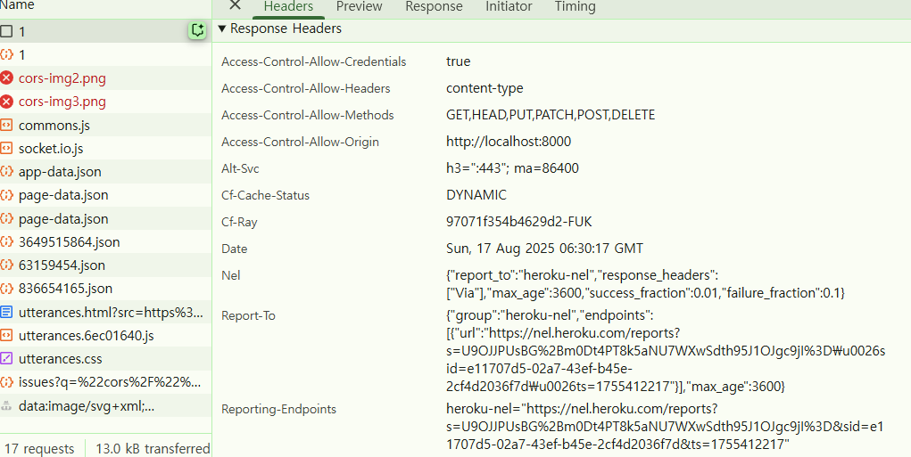

## 동일 출처 정책 (same-origin policy, SOP) 란 뭘까?
> CORS 를 이해하기 위해선 먼저 same-origin policy 를 이해해야 한다.

### 동일출처 정책(same-origin policy) 의 한 줄 요약
어떤 출처(origin)에서 불러온 문서 (HTML) 나 스크립트(Javascript)가 다른 출처(origin)에서 가져온
리소스와 상호작용하는 것을 제한하는 보안 방식이다.


## 예시로 설명

우리가 만든 애플리케이션은 크롬, 엣지 등의 브라우저를 사용한다.
그리고 그 브라우저를 통해 `XMLHttpRequest`, `Fetch` , `axios` 등을 이용해 HTTP 요청을 할 때에는
**same-origin** 정책을 따른다.

**same-origin** 정책이란 <u>같은 근원지의 **동일한 서버에서만 리소스를 요청할 수 있다는 것**을 의미한다.</u>

`http://localhost:5173` 라는 주소를 가진 프론트엔드가 백엔드 서버와 통신하기 위해서는
반드시 백엔드 서버의 API 주소도 `http://localhost:5173` 이어야 한다는 것이다.

만약 둘의 주소가 다르다면 same-origin 정책상 아래와 같은 에러를 발생시킨다.
해당 에러메시지는 브라우저 콘솔에 나타나는 경우이다.

``` 
Access to fetch at 'http://api.example.com/users' from origin 'http://localhost:3000' 
has been blocked by CORS policy: No 'Access-Control-Allow-Origin' header is present on the requested resource.
```

## 그렇다면 왜 이런 정책이 필요할까?
조금만 더 생각해보면 `http://server.com` 이라는 백엔드 API 서버가 있다고 가정해보자.
만약 이 백엔드 서버가 어떤 클라이언트의 요청이던 가리지 않고 받는다면 보안적으로 취약해 질 수 있다.

그래서 기본적으로 
> `http://server.com` 와 동일한 주소가 아닌 프론트엔드의 요청은 허락하지 않는다.

라는 것이 same-origin 정책이라고 보면 된다.


하지만 요즘에는 REST API 개발 방식에 의하면 백엔드와 프론트엔드가 나뉘어서 개발을 진행하고 작업한다.
그렇게 되면 프론트엔드는 백엔드 API  서버와 호스트가 다를 수 밖에 없어지는데, 그래서 CORS 에 대한 에러가 발생하고 우리가 경험했던 것이다.

### same-origin 을 판단하는 조건
> same-origin 이 되려면 Protocol, Port, Host 가 전부 같아야 한다.

---
## 그렇다면 CORS 란?

### CORS 의 한 줄 요약
same-origin 정책에서 벗어나도 HTTP 통신을 할 수 있도록 만든 것이 Cross-Origin Resource Sharing (CORS)이다.
즉 , CORS 정책은 SOP(same-origin policy) 의 예외 조항인 것 이다.

헷갈릴 수 도 있지만  천천히 알아가보자.
이를 이해하려면 CORS 의 탄생 배경부터 알아보는 것이 좋다.

<br>

### CORS 의 탄생 배경
- 예전의 브라우저 정책에 의하면 보안상의 이유로 origin 이 다르면 요청을 주고 받을 수 없도록 만들었다고 했다.
  하지만 웹이 발전하면서 **'프론트와 백엔드 서버의 분리'** , **'다른 출처의 데이터 사용'** , **'마이크로 서비스 아키텍처'** 등등의
  개발 방법이 나옴에 따라 , origin 이 달라도 요청을 주고 받을 수 있도록 만드는 것이 필요했다. 
  하지만 cross-origin 요청을 할 때 안전하게 처리할 정책이 필요했기 때문에 , SOP 에서 예외 조항으로 CORS 라는 정책이 추가되었다.

- 웹 생태계에는 다른 출처로의 리소스 요청을 제한하는 것과 관련된 CORS,SOP 라는 두가지 정책이 존재한다.
  그러난 웹이라는 오픈스페이스 환경에서 다른 출처에 있는 리소스를 가져와 사용하는 일은 너무나 흔한 일이다.
  그래서 이걸 막을 수도 없으니 몇 가지 예외 조항을 두고 이 조항에 해당하는 리소스 요청은 출처가 다르더라도 허용하기로 했는데,
  그 중 하나가 CORS 정책을 지킨 리소스 요청이다.


---

<br>

## CORS 인지 체크 하는 방식
### 전체 흐름

그렇다면 본격적으로 **어떤 방법을 통해 서로 다른 출처를 가진 리소스를 안전하게 사용할 수 있는지 알아보자.**

기본적으로 웹 클라이언트 애플리케이션이 다른 출처의 리소스를 요청할 때는 HTTP 프로토콜을 사용하여 요청을 보내게 되는데,
<u>이때 브라우저는 요청 헤더에 `Origin` 이라는 필드에 요청을 보내는 출처를 함께 담아보낸다.</u>

이후 서버가 이 요청에 대한 응답을 할 때, 응답 헤더의 **`Access-Control-Allow-Origin` 이라는 값에 이 리소스를 접근하는 것이 허용된 출처" 를 내려주고**, 이후 응답을 받은 **브라우저는 자신이 보냈던 요청의
Origin 과 서버가 보내준 응답의 Access-Control-Allow-Origin 을 비교**해본 후 이 응답이 유효한 응답인지 아닌지를
결정한다.

기본적인 흐름은 간단하지만, 사실 CORS 가 동작하는 방식은 한가지가 아니라 세가지의 시나리오에 따라 변경되기 때문에
우리의 요청이 어떤 시나리오에 해당되는지 잘 파악한다면 CORS  정책 위반으로 인한 에러를 고치는 것에 도움이 될 것이다.

---

## CORS 를 체크하는 3가지 방식

CORS 는 다음과 같은 3개의 타입으로 구분된다. 브라우저가 요청 내용을 분석한 뒤 한가지 방식을 선택해 서버에 요청하기 때문에,
개발자는 목적에 맞는 방식을 선택하고 조건에 맞춰 코딩해야 한다.

### 1. Preflight Request

밑에서 설명할 Simple request 의 조건에 해당되지 않은 요청에 대해서는 Preflighted requests 의 방식으로 CORS 를 체크한다.

프리플라이트(Preflight) 방식은 일반적으로 우리가 웹 어플리케이션을 개발할 때 가장 많이 마주치는 시나리오다.
이 시나리오에 해당하는 상황일 때 , 브라우저는 요청을 한번에 보내지 않고 , '예비 요청' 과 '본 요청' 으로 나누어 서버로 전송한다.

이때 브라우저가 <u>본 요청을 보내기 전에 보내는 예비 요청을 **Preflight**</u> 라고 부르는 것이며,
이 예비 요청에는 HTTP 메소드 중 `OPTIONS` 메소드가 사용 된다. 
예비 요청의 역할은 본 요청을 보내기 전에 브라우저 스스로 이 요청을 보내는 것이 안전한가? 를 확인하는 것이다.

<br>

이 과정을 간단한 흐름으로 설명하면 이렇다.

<br>

우리가 자바스크립트의 `fetch` API 를 사용하여 브라우저에게 리소스를 받아오라는 명령을 내리면
브라우저는 서버에게 예비 요청을 먼저 보내고, <u>서버는 이 예비 요청에 대한 응답으로 **현재 자신이 어떤 것들을 허용하고 , 어떤 것들을 금지하고 있는지에 대한 
정보를 응답 헤더에 담아서 브라우저에게 다시 보내주게 된다.**</u>

이후 **브라우저는 자신이 보낸 예비 요청과 서버가 응답에 담아준 허용 정책을 비교한 후 , 이 요청을 보내는 것이 안전하다고 판단되면 같은 엔드 포인트로 다시 본요청을 보내게 된다.**
이후 **서버가 이 본 요청에 대한 응답을 하면 브라우저는 최종적으로 이 응답 데이터를 자바스크립트에게 넘겨준다.**

이 플로우는 브라우저의 개발자 도구 콘솔에서도 간단하게 재현해볼 수 있는데, 
리소스 요청을 보내면 브라우저가 본 요청을 보내기 전에 `OPTIONS` 메소드를 사용해 예비 요청을 먼저 보내는 것을 확인 할 수 있다.

`about:blank` 를 주소창에 치고 들어가게 되면 빈 화면이 보인다. 여기서 F12를 눌러 개발자 도구를 열고 CONSOLE 탭에서 아래와 같은 요청을 보내보자.

```javascript
fetch('https://jsonplaceholder.typicode.com/posts/1', {
  method: 'PUT', // GET, HEAD가 아닌 다른 메서드 사용
  headers: {
    'Content-Type': 'application/json', // 커스텀 헤더 추가
  },
  body: JSON.stringify({ title: 'CORS Test' })
})
.then(response => response.json())
.then(data => console.log('성공:', data))
.catch(error => console.error('에러:', error));
```

요청을 보내고 Network 탭으로 변경 후 실제로 브라우저가 보낸 요청을 보면 , 단순히 `Origin` 에 대한 정보 뿐만 아니라 자신이 예비 요청 이후에 보낼 본 요청에 대한 다른 정보들도 함께 포함되어 있는 것을 볼 수 있다.



<br>

이미지의 **Request-Headers** 부분을 보면 여러 정보가 있는데 해당 정보들이 의미하는 바는 아래와 같다.

**1. Access-Control-Request-Method**
- 다음에 보낼 **본 요청은 이 HTTP 메서드를 사용할 예정입니다.** 라는 뜻이다.
- `Fetch` 코드에서 method: `PUT` 으로 지정했기 때문에, 브라우저는 이 헤더에 `PUT` 을 담아서 서버에 물어본다.

**2. Access-Control-Request-Headers**
- "제가 보낼 본 요청에는 이런 커스텀 헤더들이 포함될 예정입니다. 괜찮나요?"
- headers: { 'Content-Type': 'application/json' } 코드를 작성했기 때문에, 브라우저는 content-type 헤더를 보내도 되는지 서버에 문의한다.

**3. Origin**
- "이 모든 요청은 바로 여기에서 시작되었습니다."
- 서버가 어떤 출처를 허용할지 결정하는 가장 기본적인 정보다.
<br>

### 서버의 응답 허가 여부 확인하기 
더 나아가 , 서버가 이 예비 요청에 어떻게 대답했는지도 같은 화면의 응답헤더(Response Headers) 섹션에서 볼 수 있다.
서버는 Access-Control-Allow-* 라는 이름의 헤더로 허가증을 보내준다.



**1. Access-Control-Allow-Methods** 
- "네, PUT 메서드는 허용합니다. 그 외에 GET, POST 등도 괜찮습니다."

**2. Access-Control-Allow-Headers:** 
- "네, Content-Type 헤더를 포함해서 보내는 것 허용합니다."

**3. Access-Control-Allow-Origin:** 
- "네, 그 출처(Origin)에서 온 요청은 허용합니다." (예: *는 모든 출처를 허용한다는 의미)


아무튼 우리가 눈여겨 봐야할 것은 서버가 보내준 응답 헤더에 포함된 `access-control-allow-origin
http://localhost:8000` 라는 값이다.

이는 API 서버가 http://localhost:8080 에서 온 요청은 허용합니다. 라고 허가해준다는 의미이고
만약 이게 http://localhost:5173 이라면 5173만 허용한다는 뜻이니 CORS 에러가 발생했을 것이다.

---

### 2. Simple Request

이 시나리오에 대한 MDN 의 CORS 문서에 따르면 Simple Request 라고 부르고 있다.

이 단순 요청은 <u>예비 요청을 보내지 않고 바로 서버에게 본 요청을 보낸 후</u> , 
서버가 이에 대한 응답의 헤더에 `Access-Control-Allow-Origin` 과 같은 값을 보내주면 그때 브라우저가 CORS 정책 위반 여부를 검사하는 식이다.
즉, 프리플라이트와 단순 요청 시나리오는 전반적인 로직 자체는 같지만, 예비 요청을 하냐 안하냐의 차이라고 보면 된다.


하지만 아무 때나 단순 요청을 사용할 수 있는 것은 아니고, <u>특정 조건을 만족하는 경우에만 예비 요청을 생략할 수 있다.</u>
그런데 이 조건이 조금 까다롭기 때문에 일반적인 방법으로는 웹 어플리케이션 아키텍처를 설계하게 되면 거의 충족시키기 어려운 조건들이라서
경험하기가 어렵다.

조건은 아래와 같다.

- 1. 요청의 메소드는 `GET` , `HEAD` , `POST` 중 하나여야 한다.
- 2. `Accept`, `Accept-Language`, `Content-Language`, `Content-Type`, `DPR`, `Downlink`, `Save-Data`, `Viewport-Width`, `Width` 를 제외한 헤더를 사용하면 안된다.
- 3. 만약 `Content-Type`를 사용하는 경우에는` application/x-www-form-urlencoded`, `multipart/form-data`, `text/plain`만 허용된다.


1번 조건의 경우는 그냥 `PUT` 이나 DELETE 같은 메소드를 사용하지 않으면 되는 것이라서 그렇게 드문 상황은 아니지만 , 2번과 3번까지 만족하려면 까다롭다.

애초에 저 조건에 명시된 헤더들이 진짜 기본적인 헤더들이기 때문에, 복잡한 상용 웹 어플리케이션에선 이 헤더들 외에 추가적인 헤더를 사용하지 않는 경우를 찾아보기 어렵다.
당장 사용자 인증에 사용되는 `Authorization` 헤더 조차 저 조건에는 포함되지 않는다.

게다가 대부분의 HTTP API 는 `text/xml` 이나 `application/json` 컨텐츠 타입을 가지도록 설계되기 때문에 사실 상 이 조건들을 모두 만족시키는 상황을 만들기는 그렇게 쉽지 않은 것이 현실이다.

<br>

### 3. Credentialed Request

3번째 시나리오는 인증된 요청을 사용하는 방법이다.
이 시나리오는 CORS 의 기본적인 방식이라기 보다는 <u>다른 출처 간 통신에서 좀 더 보안을 강화하고 싶을 때 사용하는 방법이다.</u>

기본적으로 브라우저가 제공하는 비동기 리소스 요청 API 인 `XMLHttpRequest` 객체나 `fetch` API 는 별도의 옵션 없이 브라우저의 쿠키 정보나
인증과 관련된 헤더를 함부로 요청에 담지 않는다.
이때 요청에 인증과 관련된 정보를 담을 수 있게 해주는 옵션이 바로 `credentials` 옵션이다.

이 옵션에는 총 3가지 값을 사용할 수 있고, 각 값들이 가지는 의미는 다음과 같다.

만약 **same-origin 이나 include 와 같은 옵션을 사용하여 리소스 요청에 인증 정보를 포함한다면**,
이제 브라우저는 다른 출처의 리소스를 요청할 때 <u>단순히 Access-Control-Allow-Origin 만 확인하고 비교하는 것이 아니라 좀 더 빡빡한 검사 조건을 추가한다.</u>

---


## CORS 해결 방법
### 1. Access-Control-Allow-Origin 설정하기

CORS 정책 위반으로 인한 문제를 해결하는 가장 대표적인 방법은, 그냥 당연하게도 서버에서
Access-Control-Allow-Origin 헤더에 알맞은 값을 세팅해주는 것이다.

이때 와일드카드인 `*` 를 사용하여 이 헤더를 세팅하게 되면 모든 출처에서 오는 요청을 허락하겠다는 의미이므로
당장은 편하고 좋겠지만, 보안적으로 심각한 이슈가 발생할 수 있다.

그래서 가급적이면 귀찮지만 반드시 출처를 명시해주자.

이 헤더는 Nginx 나 Apache 와  같은 서버 엔진의 설정에서 추가 할 수도 있지만,
아무래도 복잡한 세팅을 하기에는 불편하기 때문에 소스 코드 내에서 응답 미들웨어 등을 사용하여 세팅하는 것을 추천한다.
Spring , Express, Django 와 같이 이름있는 백엔드 프레임워크의 경우에는 모두 CORS 관련 설정을 위한 세팅이나 라이브러리를 제공하고 있으니 세팅 자체는 어렵지 않을 것이다.


### 2. Webpack Dev Server 로 리버스 프록싱하기

사실 CORS 를 가장 많이 마주치는 환경은 바로 로컬에서 프론트엔드 어플리케이션을 개발하는 경우라고 해도 과언이 아닐 것이다.
백엔드에는 이미 `Access-Control-Allow-Origin` 헤더가 설정 되어있겠지만, 이 중요한 헤더에
`http://localhost:3000` 와 같은 범용적인 출처를 넣어주는 경우는 드물기 때문이다.

프론트엔드 개발자는 대부분 웹팩과 `webpack-dev-server` 를 사용하여 자신의 머신에 개발환경을 구축하게 되는데,
이 라이브러리가 제공하는 프록시 기능을 사용하면 아주 편하게 CORS 정책을 우회 할 수 있다.


이렇게 설정을 해놓으면 로컬 환경에서 `/api`로 시작하는 URL로 보내는 요청에 대해 브라우저는 `localhost:8000/api`로 요청을 보낸 것으로 알고 있지만, 사실 뒤에서 웹팩이 `https://api.evan.com`으로 요청을 프록싱해주기 때문에 마치 CORS 정책을 지킨 것처럼 브라우저를 속이면서도 우리는 원하는 서버와 자유롭게 통신을 할 수 있다. 즉, 프록싱을 통해 CORS 정책을 우회할 수 있는 것이다.

혹시 `webpack-dev-middleware`와 Node 서버의 조합으로 개발 환경을 직접 구축했더라도 `http-proxy-middleware` 라이브러리를 사용하면 손쉽게 프록시 설정을 할 수 있으니 걱정하지말자. (`webpack-dev-server`도 내부적으로는 어차피 `http-proxy-middleware`를 사용한다)

다만 이 방법은 실제 프로덕션 환경에서도 클라이언트 어플리케이션의 소스를 서빙하는 출처와 API 서버의 출처가 같은 경우에 사용하는 것이 좋다. 물론 로컬 개발 환경에서야 웹팩이 요청을 프록싱해주니 아무 이상이 없겠지만, 어플리케이션을 빌드하고 서버에 올리고 나면 더 이상 `webpack-dev-server`가 구동하는 환경이 아니기 때문에 프록싱이고 나발이고 이상한 곳으로 API 요청을 보내기 때문이다.

예를 들어 API 서버의 출처는 `https://api.evan.com`이고 클라이언트 어플리케이션을 서빙하는 서버의 출처는 `https://www.evan.com`이라면, 다음과 같은 상황이 발생한다는 것이다.

물론 비즈니스 로직 내에서 `process.env.NODE_ENV`와 같은 빌드 환경 변수를 사용하여 분기 로직을 작성하는 방법도 있지만, 개인적으로 비즈니스 로직에 이런 개발 환경 전용 소스가 포함되는 것은 별로 좋지 않다고 생각해서 피하는 편이다.

<br>

### 각 프레임 워크에서의 CORS 해결 방법


### 정리

아무래도 CORS 정책 위반으로 인해 생기는 문제를 해결할 때 가장 번거로운 점은 문제를 겪는 사람과 문제를 해결해야하는 사람이 다르다는 것이다.

앞서 이야기했지만 CORS 정책은 브라우저의 구현 스펙이기 때문에 정책 위반으로 인해 문제를 겪는 사람은 대부분 프론트 엔드 개발자이지만,
정작 문제를 해결하기 위해서는 백엔드 개발자가 서버 어플리케이션의 응답 헤더에 올바른 `Access-Control-Allow-Origin` 이 내려올 수 있도록 설정해야 하기 때문이다.

물론 `webpack-dev-server`의 프록싱 옵션을 사용하여 자체적으로 해결하는 방법도 있지만,
이 방법은 로컬 개발 환경에서만 통하는 방법인데다가, 근본적인 문제 해결 방법이 아니기 때문에 결국 운영 환경에서 CORS 정책 위반 문제를 해결하기 위해서는 백엔드 개발자의 도움이 필요할 수 밖에 없다.

사실 CORS 정책 위반은 해결하는 방법 자체가 그렇게 어렵고 복잡한 편은 아니라서 프론트엔드 개발자나 백엔드 개발자 중 한명이라도 이러한 정책에 대해서 잘 알고 있다면 생각보다 빠르게 해결할 수  있다.


## 왜 SOP , CORS 라는 귀찮은 정책을 만든 걸까? ( CORS 가 없으면 어떤 부분의 보안이 취약해지길래..? )

다른 출처로 리소스를 요청한다면 SOP 정책을 위반한 것이 되고, 거기다가 SOP의 예외 조항인 CORS 정책까지 지키지 않는다면 아예 다른 출처의 리소스를 사용할 수 없게 되는 것이다.
근데 왜 이렇게 귀찮은 정책을 만들어서 개발자들을 괴롭히는 것일까..?
**SOP , CORS 는 공격 받을 수 있는 경로를 줄여주는 정책이기 때문이다.**

만약 CORS 가 없었다면 이상한 도메인에서 내 서비스로 API 요청을 할 수 있게 되고 
내가 만든 서비스를 마음대로 가져가서 쓸 수 있는 것이다.
(엄밀히 말하면 , 브라우저에서만 이 정책이 적용되기 때문에 브라우저를 통하지 않는다면 다른 서비스의 API 요청을 시도할 수는 있다.)

## CORS 는 XSS , CSRF 를 전부 막아주지 않는다.

XSS 공격은 CORS 와 무관하다. 하지만 CSRF 여러 공격 중 일부는 CORS가 막아준다.
그렇다고 해서 CORS 가 모든 종류의 CSRF 를 막아주는 것은 아니다.

## SOP 는 어디에 적용되어 있는 것인가?

우리가 직접 SOP 를 적용할 지  안 할지를 결정할 수 없다.
클라이언트나 서버가 SOP 를 지킬 지 말 지를 선택하는 것 또한 아니다.
서버가 정할수 있는 것은 SOP 에서 CORS 를 허용할 지에 대해서만 정할 수 있다. 클라이언트에서는 어떠한 수법을 써도 SOP를 무시할 수 없다.
> 그러면 어디에서 SOP 를 적용하는 것인가?
브라우저이다. SOP 는 브라우저에서 정한 정책이기 때문이다.

## 주의점

같은 EC2에서 **admin.daly.kr(Vue.js 프론트엔드)**, **api.daly.kr(Node.js 백엔드)** 를 멀티도메인(Nginx 활용)으로 운영하고 있다고 가정하자. 

Node.js 백엔드에서의 코드 에러로 인해 제대로 된 응답을 해주지 않을 경우, 프론트엔드 입장에서 console(개발자 도구)를 보면 CORS 에러라고 찍혀있다. 브라우저 입장에서는 다른 도메인의 서버(CORS를 지키지 않은 상태)가 응답을 제대로 해주지 않을 경우, 에러를 정확히 판단하지 못하고 CORS 에러라고 판단해버린다. 그러므로 CORS 에러가 발생했을 경우, CORS를 의심하지 말고 백엔드 서버에서의 코드 에러가 아닌 지 POSTMAN으로 테스트해보자.


## Reference Blog
- [CORS(Cross-Origin Resource Sharing)](https://jaeseongdev.github.io/development/2021/05/20/CORS/)