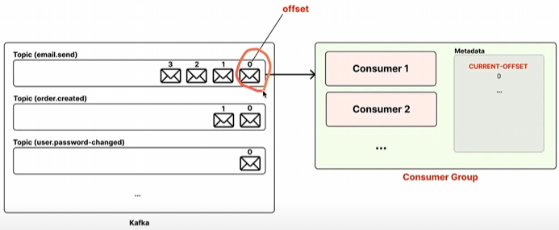
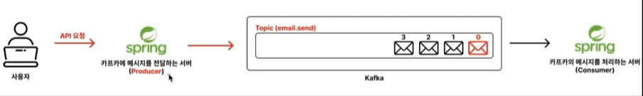
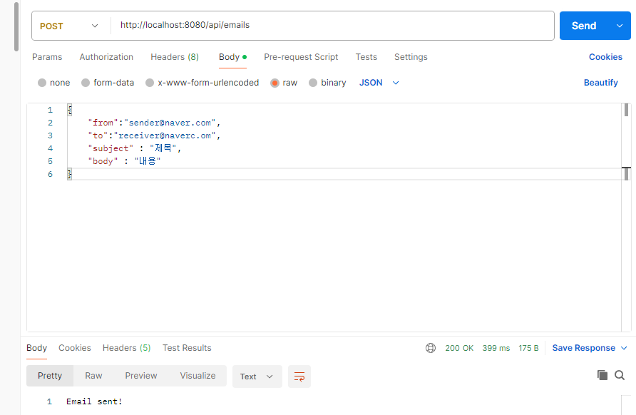
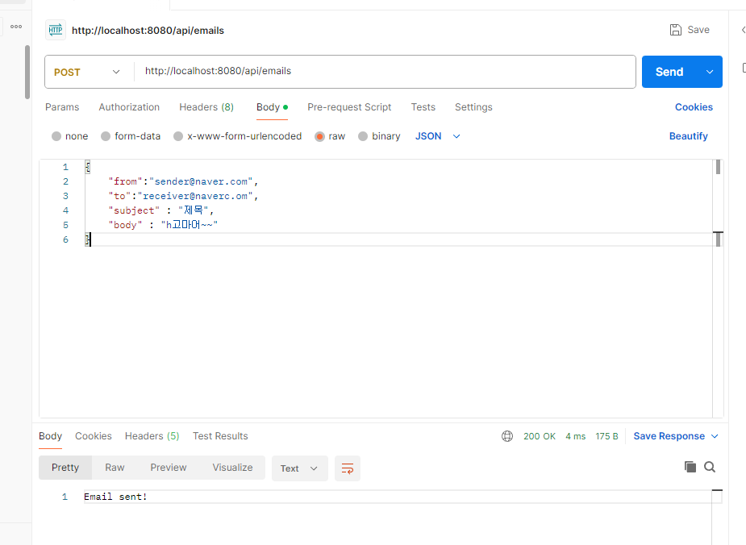
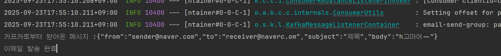

## 서론

최근에는 MSA 를 도입하는 회사가 점점 많이 늘어나고 있다.
그런데 MSA 의 방식으로 서비스를 운용할 때, Kafka 가 가진 독보적인 여러가지 장점들 때문에 MSA 에서 Kafka 를 같이 도입해서 활용하는 추세다.

이러한 이유 때문에 어느 정도 규모가 있는 IT 서비스 회사에서는 MSA 방식을 도입하고 있으며,
그에 따라 Kafka 도 같이 활용하고 있다. 회사에서 Kafka 라는 기술을 활용하고 있기 때문에 관련 업무에 참여하려면 Kafka 역량을 갖추어야 한다고 생각한다.
그래서 수많은 IT 회사에 채용 공고의 자격 요건과 우대 사항에 Kafka 에 대한 역량을 기재해놓는 것이다.

그래서, 혼자 프로젝트를 진행하면서 MSA 같은 규모가 큰 프로젝트를 진행할 일이 없어 미루어 놓았지만
이번 기회에 Kafka 에 대해서 공부하고 알아나갈 생각이다.

## Kafka 란? / 메시지 큐(Message Queue) 란?


### 카프카(kafka)란?

Kafka 의 의미를 검색해보면 아래와 같다.

> **Apache Kafka** 는 수천개의 회사에서 고성능 데이터 파이프라인, 스트리밍 분석, 데이터 통합 및 미션 크리티컬 애플리케이션에 사용되는 오픈소스 분산 이벤트 스트리밍 플랫폼이다. 
> 
>-_Apache Kafka 공식 홈페이지-_

정의를 보았을 때 이해하기가 어려웠다. 간단히 설명하자면 
> Kafka 는 대규모 데이터를 처리할 수 있는 **메시지 큐**이다.

이렇게만 알고 있어도 충분하다. 하지만 이 의미를 정확하게 이해하려면 <u>**메시지 큐**</u> 가 무슨 뜻인지 알아야 한다.

### 메시지 큐란?

**메시지 큐**는  <u>**큐 형태에 데이터를 일시적으로 저장하는 임시 저장소**</u>를 의미한다.
메시지 큐를 활용하면 <u>비동기적</u>으로 데이터를 처리할 수 있어서 효율적이다.

이 의미를 정확하게 이해하기 위해 **'REST API 방식으로 통신하는 방식'** 과 **'메시지 큐를 활용한 통신 방식'** 을 비교해보자


### REST API 방식으로 통신 VS 메시지 큐를 활용한 통신

REST API 방식은 요청을 보낸 뒤에 <u>모든 작업이 다 처리될 때 까지 기다렸다가 응답을 받는 식</u>으로 통신을 한다.

하지만 메시지 큐를 활용한 통신 방식은 비동기적으로 작업을 처리하기 때문에 모든 작업이 다 처리되는 것과 상관 없이 응답을 받을 수 있다.
메시지 큐를 활용한 통신 과정을 아래에서 하나하나 자세히 살펴보자.

1. 사용자가 REST API 방식으로 요청을 보낸다.
2. 요청을 받은 서버는 메시지 큐에 전달할 메시지를 만들어 전달한다.
    - 메시지 안에는 처리해야 할 요청에 대한 정보들이 담겨있따.
    - 메시지 큐는 처리해야 할 메시지들을 보관하는 임시 저장소 역할을 한다.
    - 메시지를 만들어 메시지 큐로 전달하는 서버를 보고 <u>**프로듀서**</u> 라고 얘기한다.
3. Producer 서버는 메시지 큐에 메시지를 넣자마자 사용자에게 성공 응답을 한다.
    - 이메일 작업이 끝날 때 까지 기다렸다가 응답을 하는 것이 아니라, 메시지 큐에 메시지를 넣자마자 응답을 했다. 이렇게 처리하는 방식을 보고 <u>'비동기 방식으로 처리했다.'</u> 라고 표현한다.
    - <u>**비동기 방식 **</u>으로 처리하기 떄문에 요청을 효율적으로 처리할 수 있다. 이 때문에 대규모 트래픽을 처리할 때도 유리한 구조이다.

4. 메시지 큐는 Producer 로부터 받은 메시지를 보관하고 있는다.
5. Consumer 서버가 메시지 큐에 들어있는 메시지를 꺼내서 실제 작업을 수행한다.
   - 메시지를 꺼내서 처리하는 서버를 보고 <u>**컨슈머(Consumer)**</u>라고 얘기한다. (Consumer : 소비하다, 소비자 .. )


다시 한번 메시지 큐와 Kafka 에 대한 의미를 되짚어 보자.

- 메시지 큐는 <u>**데이터를 일시적으로 큐 형태로 저장하는 임시 저장소를 의미한다.**</u> 메시지 큐를 활용하면 비동기적으로 데이터를 처리할 수 있어서 효율적이다.
- <u>**Kafka**</u> 는 <u>**대규모 데이터를 처리할 수 있는 메시지 큐**</u>이다.


그렇다면 이 메시지 큐 Kafka 를 설치하고 스프링부트와 연결하여 사용해보자.


### AWS EC2에 Kafka 설치하기

Kafka 를 설치하기 전에 jdk 17 버전을 먼저 설치하자.
jdk 를 설치하는 이유는 Kafka 를 실행시키기 위해서는 jdk 17버전 이상이 필요하다고 공식 홈페이지에 명시 되어있기 때문이다.

```shell
sudo apt update
sudo apt install openjdk-17-jdk

// java --version  설치가 잘되었는지 이 명령어로 확인하자.
```

이젠 Kafka 설치 파일을 다운로드 받을 차례이다.

```shell
wget https://dlcdn.apache.org/kafka/4.0.0/kafka_2.13-4.0.0.tgz
```

다운로드 받아진 .tgz 확장자 명의 파일 압축을  풀기 위해 아래 명령어를 입력하자.

```shell
tar -xzf kafka_2.13-4.0.0.tgz
```

압축을 풀고 나서 폴더로 들어가게 되면 여러 폴더와 파일들이 있다.
우리는 카프카를 실행시켜야하는데, 그 전에 Kafka 를 실행시켰을 때 잡아먹는 메모리 크키를 낮추어야 한다.
왜냐하면 현재 EC2 프리티어로 이용 중인 t3.micro 는 메모리 사양이 1GB 밖에 안되기 때문에 Kafka 를 실행시키기엔 부족한 사양이다.
그래서 카프카를 실행시킬 때 Kafka 가 잡아먹는 메모리를 강제로 낮추어야만 버벅거리지 않고 실행되게 된다.

```shell

export KAFKA_HEAP_OPTS="-Xmx400m -Xms400m"

```

또 한 가지의 조치가 필요 한데, Swap 이라는 기법이다.

swap 을 활용하게 되면 ec2 인스턴스에 부족한 메모리 사양을 어느정도 보완 할 수 있다.

```shell
sudo add if=/dev/zero of=/swapfile bs=128M count=16
```

/swapfile 이라는 경로에 2G 짜리 파일을 생성한다는 명령어이고 권한을 부여한다.

```shell
sudo chmod 600 /swapfile
```

만들었던 2기가의 파일을 메모리로 대체해서 사용할 수 있는 공간으로 변환한다.
```shell
sudo mkswap /swapfile
```

스왑공간으로 전환한 것을 활성화 한다.

```shell
sudo swapon /swapfile
```

시스템 부팅을 할 때마다 (ec2 인스턴스를 껏다가 키더라도) 자동으로 스왑메모리의 공간이 활성화 되도록 파일 시스템을 수정한다.

```shell
sudo vi etc/fstab
```

vi 에디터가 열리면 아래와 같이 입력한다.

```shell
/swapfile swap swap default 0 0
```

스왑 메모리가 잘 설정 되어있는지 확인하는 명령어
```shell
free
```

Kafka 를 실행시키기 전 메모리 설정은 완료가 되었고 카프카를 실행시키기 전 카프카 설정을 수정해주어야한다.

Kafka 설정 파일은 `config/server.properties` 이다.

```shell
vi config/server.properties
```

Kafka 설정 파일에 들어가서 아래로 내려 자세히 보면 아래와 같은 설정이 있다.
이 설정은 클라이언트가 외부에서 카프카로 접근할 때 사용하는 주소가 작성되어야 한다. 즉, 외부에서 접근할 때 사용하는 주소로 이해하면 된다.
EC2 를 사용하고 있다면 localhost 가 아니라 EC2 에 Public 주소로 변경해주자.

```shell
advertised.listeners = PLAINTEXT://localhost:9092,CONTROLLER://localhost:9093
                                 //13.125.xxx.xxx,CONTROLLER://13.125.xxx.xxx
```


이렇게 Kafka 서버를 실행시키기 위한 설정은 끝이 났다. 하지만 한 가지 더 설정해야 할 것이 있는데 초기 로그 폴더를 세팅 해야한다.
Kafka 가 작업을 할 때 작업하는 공간이 필요하게 되는데 그걸 위해 설정하는 것이다.

```shell 

KAFKA_CLUSTER_ID="$(bin)/kafka-storage.sh random-uuid"
bin/kafka-storage.sh format --standalone -t $KAFKA_CLUSTER_ID -c config/server.properties
```

명령어가 성공했다면 초기 로그 폴더가 어디에 생성이 되었는지 경로가 나올 것이다.


잘 설정이 되었다면 Kafka 설치 폴더에 돌아가서 이제 카프카를 실행해보자.


```shell
// 포어그라운드 실행
bin/kafka-server-start.sh config/server.properties
// config/server.properties 파일을 기반으로 .sh 파일을 실행 시키는 명령어 
```

```shell
// 백그라운드 실행
bin/kafka-server-start.sh -daemon config/server.properties
```

만약 실행을 백그라운드로 했다면 로그들이 보이지 않는다. 로그를 직접 확인하려면 아래와 같은 명령어를 입력한다.

```shell 
tail -f  logs/kafkaServer.out
```

백그라운드에서 실행되고 있는 Kafka 서버를 종료하려면  아래와 같은 명령어를 입력한다.

```shell 
bin/kafka-server-stop.sh
```

Kafka 에 어떤 명령을 내릴 땐 Kafka 에서 직접 만들어놓은 여러 .sh (쉘스크립트) 파일을 실행시키면서 명령을 내리게끔 셋팅이 되어있다.


## Kafka 의 기본 구성

### Kafka 의 기본 구성 (Topic,Consumer,Producer)

- 프로듀서 : 카프카에 메시지를 전달하는 주체
- 컨슈머 : 카프카의 메시지를 처리하는 주체
- 토픽 : 카프카에 넣을 메시지의 종류를 구분하는 개념 (ex: 카테고리)

프로듀서는 Kafka 로 메시지를 전달한다. 그러면 Kafka 는 메시지 큐에 <u>**토픽**</u>별로 구분해 전달받은 메시지를 저장해둔다.
컨슈머는 Kafka 에 새로운 메시지가 생겼는 지 주기적으로 체크하다가, 새로운 메시지가 있다는 걸 발견하면 그 메시지를 조회해와서 처리한다.


Kafka 는 메시지를 보관하는 임시 저장소라고 했었는데, 이 메시지를 체계적으로 보관하기 위해서 Topic 이름을 붙인다.
예를 들어, `email.send` 라는 Topic 을 붙이면 이메일을 전송할 때 필요한 메시지들은 그 곳에 저장하여 분류한다.

중요한건 Topic 은 Kafka 가 마음대로 분류하는 것이 아니라, Producer 가 Kafka 에게 `email.send` 라는 토픽에 메시지 저장 요청을 한다.


## 토픽 생성하기 / 조회하기 / 삭제하기

### CLI 를 활용한 Kafka 조작
백엔드 서버로만 Kafka 를 조작할 수 있는 것이 아니다. 실제로는 CLI 로도 Kafka 의 모든 기능을 조작할 수 있다.

주키퍼 실행
```shell
// windows
.\bin\windows\zookeeper-server-start.bat .\config\zookeeper.properties

// ec2/linux
bin/zookeeper-server-start.sh config/zookeeper.properties
```

카프카 브로커 실행
```shell 
// windows
.\bin\windows\kafka-server-start.bat .\config\server.properties

// ec2/linux
bin/kafka-server-start.sh config/server.properties
```

토픽 목록 조회

```shell
// Windows
.\bin\windows\kafka-topics.bat --bootstrap-server localhost:9092 --list 

// EC2/Linux
bin/kafka-topics.sh --bootstrap-server localhost:9092 --list
```

토픽 생성

```shell 
// Windows
.\bin\windows\kafka-topics.bat --bootstrap-server localhost:9092 --create --topic email.send --partitions 1 --replication-factor 1

// EC2/Linux
bin/kafka-topics.sh --bootstrap-server localhost:9092 --create --topic email.send --partitions 1 --replication-factor 1
```

토픽 상세 정보 확인

```shell
// Windows
.\bin\windows\kafka-topics.bat --bootstrap-server localhost:9092 --describe --topic email.send

// EC2/Linux
bin/kafka-topics.sh --bootstrap-server localhost:9092 --describe --topic email.send

```

토픽 삭제
```shell
// Windows
.\bin\windows\kafka-topics.bat --bootstrap-server localhost:9092 --delete --topic email.send

// EC2/Linux
bin/kafka-topics.sh --bootstrap-server localhost:9092 --delete --topic email.send
```


## Kafka에 메시지 넣고 Kafka 에서 메시지 조회하기

토픽을 생성하고 메시지를 넣으려면 메시지를 넣는 명령어를 입력해야한다.
카프카에 넣는 메시지는 key-value 형태로 넣을 수도 있고 value 만 넣을 수도 있다.
우리는 먼저 value 만 넣는 방식을 배워보자.


```shell 

bin/kafka-console-producer.sh --bootstrap-server localhost:9092 --topic email.send

```

해당 명령을 입력하면 쉘이 입력을 기다리는 상태로 변한다. 아무런 메시지나 여러개 입력하고 보내 보자.
```shell 
> hello
> hello1
> hello2
```
메시지를 보냈으니 메시지를 조회해야하는데, 그 전에 알고 가야할 것이 있다.
전통적인 메시지 큐 (RabbitMQ, SQS) 는 메시지를 꺼내서 읽어들이면 해당 메시지를 큐에서 제거하는 구조이다.
반면에 Kafka는 메시지를 읽고 제거하는 방식이 아니라, 저장되어 있는 메시지를 읽기만 하고 제거하지 않는 방식으로 작동한다.
이런 구조 덕분에 Kafka는 같은 메시지를 여러 번 읽는게 가능하다.

1. 특정 토픽에 쌓인 메시지 전부 조회하기 + 실시간으로 메시지 조회하기
```shell
.\bin\windows\kafka-console-consumer.bat --bootstrap-server localhost:9092 --topic email.send --from-beginning
// 메시지를 전부 조회하며 그 후엔 실시간 메시지도 읽는다.
```

2. 실시간으로 들어오는 메시지 조회하기
```shell 
.\bin\windows\kafka-console-consumer.bat --bootstrap-server localhost:9092 --topic email.send
// 컨슈머가 시작된 시점 이후에 토픽으로 들어오는 메시지만 실시간으로 읽어온다.
```


1번 방법을 실행한 후 새로운 콘솔 창을 열어서 메시지를 보내게되면 이미 있던 메시지들을 불러오고 새로운 메시지를 보내면 실시간으로 불러오는 것을 확인 할 수 있다.
간혹 메시지가 실시간으로 안 나타날 때가 있는데 카프카는 효율성을 위해 여러 개의 작은 메시지를 한데 모아서 묶어 처리하는 경우가 많다고 한다.
즉 , 즉시 전송하지 않고, 일정 시간 동안 메시지가 쌓이거나 특정 크기에 도달했을 때 한 번에 전송한다고 한다. 이 과정에서 미세한 지연이 발생하여 메시지가 느리게 보일 수 있다.

필자는 왜 안 오는건지 생각했는데 보낸 메시지들이 어느새 나타나 있었다.


## 메세지를 어디까지 읽었는지 기억하고, 그 다음 메시지부터 처리하기

Kafka 에서 컨슈머 그룹 이라는 개념을 활용하면, 각 컨슈머 그룹이 메시지를 어디까지 읽었는지 <u>오프셋</u> 이라는 번호로 기록해둔다.
이 덕분에 컨슈머 그룹에 속해있는 컨슈머들은 <u>**안 읽은 메시지부터 순차적으로 메시지를 읽게 된다.**</u>


> [용어 정리]
> - 컨슈머 : 카프카의 메시지를 처리하는 주체
> - 컨슈머 그룹 : 1개 이상의 컨슈머를 하나의 그룹으로 묶은 단위
> - 오프셋 : 메시지의 순서를 나타내는 고유 번호 (카프카에서는 **마치 배열에서의 인덱스와 같은 개념**을 오프셋이라는 단어로 표현하는 것과 비슷하다.)

<br>


- 토픽에 저장되어 있는 여러 메시지는 메시지의 순서를 나타내는 고유 번호인 **오프셋** 을 가지고 있다.
- 오프셋 번호는 인덱스처럼 0부터 시작한다.
- 컨슈머 그룹은 1개 이상의 컨슈머를 가질 수 있다.
- 컨슈머 그룹은 어디까지 메시지를 읽었는 지에 대한 정보를 알고 있다.
  - `CURRENT-OFFSET` : 다음에 읽을 메시지의 오프셋 번호 

<br>

이제 배운 지식을 실습을 통해 확인해보자.


메시지 조회
```shell 
.\bin\windows\kafka-console-consumer.bat --bootstrap-server localhost:9092 --topic email.send --from-beginning --group email-send-group
                                                                                              // 어떤 메시지까지 읽었는지 기록이 없다면 처음부터.
                                                                                              // 기록이 존재하면 그 다음 메시지부터 읽는다.                                                                
```

컨슈머 그룹 조회

```shell
.\bin\windows\kafka-consumer-groups.bat --bootstrap-server localhost:9092 --list

```

컨슈머 그룹 상세 조회

```shell 
// 명령어
.\bin\windows\kafka-consumer-groups.bat --bootstrap-server localhost:9092 --group email-send-group --describe

// 결과
Consumer group 'email-send-group' has no active members.

GROUP            TOPIC           PARTITION  CURRENT-OFFSET  LOG-END-OFFSET  LAG             CONSUMER-ID     HOST            CLIENT-ID
email-send-group email.send      0          4               0               0               -               -               -

```

컨슈머 그룹 상세 조회 명령어를 입력 했을 때 결과가 나오게 되는데, 그 중 **CURRENT-OFFSET** 을 봐보자.
이 **CURRENT-OFFSET** 의 값은 현재 4 인데 이 값의 의미는
<u>**0,1,2,3 의 오프셋 값을 가진 메시지들은 전부 읽었고 다음에 읽을 메시지의 OFFSET 은 4 라는 것이다.**</u>


Producer 를 통해 메시지를 추가하고 다시 한번 컨슈머 그룹을 상세 조회해보자.

```shell 
// 메시지 추가
PS C:\kafka_2.13-2.8.0> .\bin\windows\kafka-console-consumer.bat --bootstrap-server localhost:9092 --topic email.send --from-beginning --group email-send-group
hi
Processed a total of 1 messages

// 컨슈머 그룹 상세 조회
PS C:\kafka_2.13-2.8.0> .\bin\windows\kafka-consumer-groups.bat --bootstrap-server localhost:9092 --group email-send-group --describe

Consumer group 'email-send-group' has no active members.

GROUP            TOPIC           PARTITION  CURRENT-OFFSET  LOG-END-OFFSET  LAG             CONSUMER-ID     HOST            CLIENT-ID
email-send-group email.send      0          5               5               0               -               -               -

```

CURRENT-OFFSET 을 다시 보면 값이 5로 변경되었다. 메시지를 하나 추가로 보냈으니 이제 다음에 읽을 메시지의 OFFSET 은 5로 변경 된 것이다.


### 정리

<u>실제 서비스에서 똑같은 요청을 중복해서 여러번 처리하면 안 된다. 그래서 **반드시 컨슈머 그룹을 활용해서 메시지를 읽어야 한다**.</u>
그래야 컨슈머 그룹이 메시지를 어디까지 읽었는 지 메시지의 오프셋 값으로 기억해뒀다가, 아직 처리하지 않은 그 다음 메시지부터 처리할 수 있게 된다.


---

## Spring Boot 에 Kafka 연결 하기

스프링 부트 프로젝트를 만들고 kafka 의존성을 추가 하자. 그리고 그 후에 kafka 연결을 위한 .yml 파일 설정이 필요하다.

```text
implementation 'org.springframework.kafka:spring-kafka'
```

```yml 
spring:
  kafka:
    bootstrap-servers: localhost:9092
    producer:
      # 카프카의 프로듀서 서버에서 메시지의 키를 직렬화 할 때 어떤 방식으로 할 것인지 설정
      key-serializer: org.apache.kafka.common.serialization.StringSerializer
      # 메시지의 value 값을 어떤 식으로 직렬화 할 것인지 설정
      value-serializer: org.apache.kafka.common.serialization.StringSerializer
```


## Spring Boot 로 Kafka 에 메시지 넣는 코드를  (Producer 서버 만들기)

아래 그림과 같이 Spring Boot 서버를 활용해 Kafka 메시지를 넣어보자.




먼저, 사용자로부터 api 요청을 받을 Controller 를 생성하자.

```java 
@RestController
@RequestMapping("/api/emails")
public class EmailController {

	private final EmailService emailService;

	public EmailController(EmailService emailService){
		this.emailService = emailService;
	}

	@PostMapping
	public ResponseEntity<String> sendEmail(@RequestBody sendEmailRequestDto) {
		emailService.sendEmail();
		return ResponseEntity.ok("Email sent!");
	}

}
```

요청을 담을 DTO 도 생성한다.

```java 
public class SendEmailRequestDto {
	private String from;
	private String to;
	private String subject;
	private String body;

	public String getFrom() {
		return from;
	}

	public String getTo() {
		return to;
	}

	public String getSubject() {
		return subject;
	}

	public String getBody() {
		return body;
	}
}

```

서비스도 생성한다.
```
@Service
public class EmailService {

	private final KafkaTemplate<String, String> kafkaTemplate;

	public EmailService(KafkaTemplate<String, String> kafkaTemplate) {
		this.kafkaTemplate = kafkaTemplate;
	}

	public void sendEmail(SendEmailRequestDto request) {
		EmailSendMessage emailSendMessage = new EmailSendMessage(
			request.getFrom(),
			request.getTo(),
			request.getSubject(),
			request.getBody()
		);
      // 카프카 템플릿을 톨해 email.send 토픽에 자바 객체를 json 으로 변환하여 전달
		this.kafkaTemplate.send("email.send", toJsonString(emailSendMessage));
	}

    // 자바 객체를 Json 으로 변환해주는 메서드
	private String toJsonString(Object object) {
		ObjectMapper objectMapper = new ObjectMapper();

		try{
			String message = objectMapper.writeValueAsString(object);
			return message;

		}catch (JsonProcessingException e) {
			throw  new RuntimeException("Json 직렬화 실패");
		}

	}
}
```


## Spring Boot가 Kafka 에 메시지를 잘 넣는지 테스트해보기

깔끔하게 다시 시작하기 위해 이전에 만들었던 email.send 토픽과 컨슈머 그룹을 전부 지운다.

```shell
PS C:\kafka_2.13-2.8.0> .\bin\windows\kafka-consumer-groups.bat --bootstrap-server localhost:9092 --list
PS C:\kafka_2.13-2.8.0>

```

아무것도 나오지 않는다면 정상 삭제가 되었고 다시 토픽을 만들어준다.

```shell 
.\bin\windows\kafka-topics.bat --bootstrap-server localhost:9092 --create --topic email.send
WARNING: Due to limitations in metric names, topics with a period ('.') or underscore ('_') could collide. To avoid issues it is best to use either, but not both.
Created topic email.send.
```

토픽도 잘 생성되었다면 스프링 부트 애플리케이션을 실행하자.

실행이 잘되었다면 요청을 보내야한다.
이전에 사용자의 요청을 받을 수 있도록 Controller 를 만들었었다.
`/api/emails` 로 요청을 보내야 하는데 필자는 Postman 을 사용해서 요청했다.



요청의 body 는 우리가 만들었던 SendEmailRequestDto 에 맞춰 작성하고 전송한다.
위 그림을 보면 성공적으로 응답이 반환되었다.

응답은 왔지만 정말 Kafka 에 스프링부트가 메시지를 잘 넣었을까?
한번 확인해보자.

```shell 
// 명령어
.\bin\windows\kafka-console-consumer.bat --bootstrap-server localhost:9092 --topic email.send --from-beginning

//결과
{"from":"sender@naver.com","to":"receiver@naver.om","subject":"제목","body":"내용"}
```
결과를 보니 API 요청을 받은 Spring Boot 서버가 요청을 잘 처리한 것 같다.

스프링 부트 서버는 받은 요청 정보 객체를 json 형태의 String 타입으로 변환시켜 준 뒤 Kafka의 `email.send` 토픽으로 전달 했다.


## 스프링 부트로 Kafka 에서 메시지 조회하기 (Consumer 서버)

스프링 부트 프로젝트를 새롭게 생성하고 .yml 파일을 작성하자.

```yml
server:
  port: 0

spring:
  kafka:
    bootstrap-servers: localhost:9092
    consumer:
      # 메시지의 키를 어떤 방식으로 역직렬화 할 것인지 설정
      key-deserializer: org.apache.kafka.common.serialization.StringDeserializer
      # 메시지의 값을 어떤 방식으로 역직렬화 할 것인
      value-deserializer: org.apache.kafka.common.serialization.StringDeserializer
      # 컨슈머 그룹이 미리 안만들어져 있다면 컨슈머 그룹을 직접 생성하여 메시지를 가장 빠른 것부터 읽어오는 설정
      # 만약 컨슈머 그룹이 이미 만들어져 있다면 해당 컨슈머 그룹이 읽었던 메시지 부터 읽는다 (처음부터 읽지 않는다 )
      auto-offset-reset: earliest

```

그 후 카프카에서 직렬화된 메시지를 객체로 매핑시킬 클래스가 필요하다.
EmailSendMessage 클래스를 생성하자.

```java 
public class EmailSendMessage {
	private String from;
	private String to;
	private String subject;
	private String body;

	public EmailSendMessage() {
	}

	public EmailSendMessage(String from, String to, String subject, String body) {
		this.from = from;
		this.to = to;
		this.subject = subject;
		this.body = body;
	}

	public static EmailSendMessage fromJson(String json) {
		try{
			ObjectMapper objectMapper = new ObjectMapper();
			return objectMapper.readValue(json, EmailSendMessage.class);
		}catch (JsonProcessingException e) {
			throw new RuntimeException("Json 파싱 실패");
		}
	}

	public String getFrom() {
		return from;
	}

	public String getTo() {
		return to;
	}

	public String getSubject() {
		return subject;
	}

	public String getBody() {
		return body;
	}
}

```


`EmailSendConsumer` 클래스를 작성한다.
해당 클래스는 카프카로부터 주기적으로 메시지를 조회하고 읽어오는데 해당 기능은 
`@KafkaListener` 어노테이션을 사용하여 간단하게 이용 가능하다.


```java 
@Service
public class EmailSendConsumer {

	@KafkaListener(
		topics = "email.send",
		groupId = "email-send-group"
	)
	public void consume(String message){
		System.out.println("카프카로부터 받아온 메시지 :" + message);

		EmailSendMessage emailSendMessage =  EmailSendMessage.fromJson(message);

		// .. 실제 이메일 발송 로직은 생략..

		System.out.println("이메일 발송 완료");
	}
}
```


이제 우리가 만든 Consumer 스프링 부트 서버를 실행 시킨 후에 Postman 으로 프로듀서 서버에 요청을 보내게 되면
**프로듀서 서버는 메시지를 카프카에 넣게되고 카프카를 주시하고 있는 콘슈머 서버는 해당 메시지를 읽어오게 된다.**

한번 API 요청을 통해 직접 확인해보자.




스프링 부트의 콘솔에 로그를 확인하게 되면 우리가 보낸 메시지를 잘 읽어온 것을 확인할 수 있다.




## 정리

이전에 API 요청을 통해 Producer 서버를 거쳐 Kafka 의 email.send 토픽에 메시지를 쌓아뒀다.
그러고 Consumer 서버가 email.send 토픽에 쌓여있는 메시지를 하나씩 읽어들이면서 처리했다.


---


## Kafka 의 비동기 처리로 인한 성능 이점을 느껴보기

REST API 방식은 요청을 보낸 뒤에 모든 작업이 다 처리될 때까지 기다렸다가 응답을 받는 식으로 통신을 한다고 얘기했다.
그래서 만약 이메일 발송을 처리하는 데 시간이 오래걸린다면 늦게 응답을 받을 수 밖에 없다.

하지만 메시지 큐를 활용한 통신 방식은 비동기적으로 작업을 처리하기 때문에 모든 작업이 다 처리되는 것과 상관 없이 빠르게 응답을 받을 수 있다고 설명했다. 정말 그런지 확인해보자.

```java 
@Service
public class EmailSendConsumer {

	@KafkaListener(
		topics = "email.send",
		groupId = "email-send-group"
	)
	public void consume(String message){
		System.out.println("카프카로부터 받아온 메시지 :" + message);

		EmailSendMessage emailSendMessage =  EmailSendMessage.fromJson(message);

		// .. 실제 이메일 발송 로직은 생략..

		try{
			Thread.sleep(3000);

		}catch (InterruptedException e){
			throw  new RuntimeException("이메일 발송 실패");
		}

		System.out.println("이메일 발송 완료");
	}
}
```

위 코드를 보면 변경점이 있다. Thread 관련 코드가 추가되었다.
이전 코드에서는 실제 이메일 발송 로직은 생략했기 때문에 따로 이메일 처리 시간 비용이 발생하지 않았다.
하지만 실제 서비스에서는 이메일 발송 시간이 생기기 마련인데 테스트를 위해 이메일 발송 시간이 생기도록 오래 걸리도록 코드를 추가했다.

그리고 나서 API 요청을 보내게되면 3초 이상이 걸릴거라는 예상과는 달리 응답은 7ms 로 아주 빨랐다.
이는 이메일 발송에 아무리 오랜 시간이 걸리더라도 응답은 아주 빠르게 받을 수 있는 것이다.

그래서 사용자 입장에서는 '이메일 발송이 느리다' 라는 체감을 하지 못하는 장점이 있다.


### 비동기로 처리하면 Consumer가 제대로 작업을 처리했는 지 어떻게 확신할 수 있을까?

기존에 REST API 방식을 활용해 <u>동기적으로 처리할 때는 이메일 발송 처리 작업이 끝날 때까지 기다렸다가 응답을 한다.</u>
그러다보니 비교적 응답 속도가 느릴 수 밖에 없다. 그리고 이메일 발송 처리 작업이 끝난 뒤에 응답을 하기 때문에, 이메일 발송의  성공 여부를 확인하고 그에 맞게 응답할 수 있다.


반면에, Kafka와 같은 메시지 큐를 활용한 <u>**비동기 처리는 사용자에게 빠르게 응답을 줄 수 있다는 큰 장점이** 있다.</u>
실제로 이메일 발송처럼 시간이 오래걸리는 작업도 Kafka 에 메시지만 넣고 바로 응답할 수 있기 때문에, 사용자 입장에서는 기다림 없이 빠르게 처리가 된 것처럼 느껴진다.
하지만 **이 구조는 한 가지 중요한 한계를 가지고 있다.**

바로 사용자에게 작업의 실제 성공 여부를 확인하지 않고 응답을 먼저 보내버린다는 점이다. 예를 들어, 이메일 발송 요청을 Kafka에 메시지로 넣고 25ms 만에 성공 응답을 보냈지만,
이후 Consumer 쪽에서 잘못된 이메일 주소로 인해 이메일 발송 도중 실패가 발생할 수 있다. 이 때는 이미 사용자에게 성공 응답을 보낸 상태이기 때문에 실패를 다시 사용자에게 알려줄 방법이 없다.

이러한 비동기 구조의 단점을 보완하기 위해 시스템에서는 다양한 보완 전략을 사용한다. 대표적으로는 <u>**메시지 처리 중 실패가 발생했을 때 자동으로 재시도(retry)** 하는 방식, 여러 번의 재시도 끝에도 실패한 메시지를 별도로 보관하는 **Dead Letter Topic(DLT)** 을 활용하는 방식을 주로 활용한다.</u>

## 끝으로

필자는 이전에 kafka 를 사용하진 않았지만 이메일 비동기 처리에 대해서 고민했던 적이 있다.
`@Async` 를 통해서 비동기 적으로 처리했었는데 그 이후에 전송이 실패하면 어떻게 하지? 라는 고민을 했었다.
다음 포스팅은 Kafka 를 사용할 때 이러한 한계를 보완할 수 있는 전략에 대해서 학습하고 다뤄볼려고 한다.