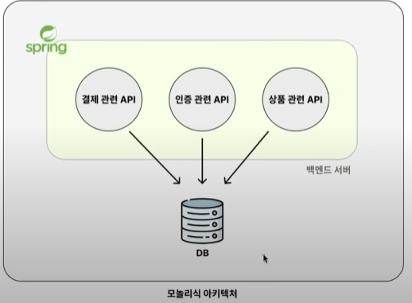
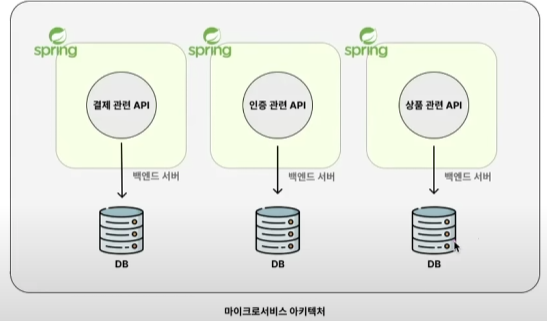
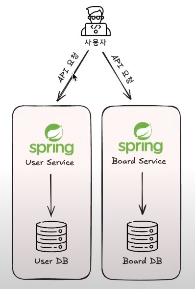

## MSA 란?

MSA 의 의미를 검색해보면 아래와 같이 나온다.

> 하나의 큰 애플리케이션을 <u>여러 개의 작고 독립적인 서비스로 나누어 개발하고 배포하는 소프트웨어 개발 아키텍처</u> 를 의미한다.

아래의 그림을 참고하여 조금 더 직관적으로 이해해보자.

일반적으로 백엔드 서버를 구성할 때 활용하는 구조가 모놀리식 아키텍처다.
프로젝트 하나에 모든 API(결제 API, 인증 API, 상품 API) 를 전부 구현하는 방식이다.

하지만 **마이크로서비스 아키텍처(MSA)** 는 서비스에 필요한 API 들을 하나의 프로젝트가 아닌 <u>여러 개의 프로젝트로 나눠서 구현하는 방식</u>이다.
위 그림을 보면 결제 관련 API 들끼리 모아놓은 프로젝트와, 인증 관련 API, 상품관련 API들 끼리 모아놓은 프로젝트를 분리해서 구성했다. 그리고 MSA 에서는 **독립적으로 분리된 하나의 프로젝트를 서비스** 라고 부른다.

## MSA 의 핵심 특징 / MSA 의 장점

MSA 는 다양한 특징을 가지고 있다. 그 중에서 가장 핵심 특징은 <u>**독립성**</u>이다.
결제에 관련된 기능, 인증에 관련된 기능, 상품에 관련된 기능을 독립적으로 분리해서 프로젝트를 구성한다면 그게 바로 MSA 의 방식대로 서비스를 분리해서 구성한 것이다.
이렇게 하나의 애플리케이션을 여러 개의 독립적인 서비스로 분리시킴으로써 다양한 장점이 생긴다.

### 서비스 별 독립적인 배포 -> 배포의 사이클이 빨라진다.

하나의 큰 프로젝트를 60명이서 작업하는 것보다, 여러 개의 프로젝트로 나눠서 각 프로젝트를 관리하는 팀을 구성해 독립적으로 작업하는 게 훨씬 효율적일 것이다.
- 서로 의사소통할 인원이 적기 때문에 프로젝트 진행이 빠르다.
- 팀이 독립적으로 개발/배포를 진행할 수 있다.
- 코드의 양이 비교적 작기 때문에 코드 작성, 테스트, 빌드 과정의 시간이 훨씬 적게 걸린다.

> 실제로 배달의민족과 같이 규모가 있는 회사들의 팀 구성을 본다면 배민상품시스템팀, 정산시스템팀 등 다양한 팀으로 나뉘어져있다. 배달의 민족이라는 하나의 서비스를 여러개 프로젝트로 쪼개서 각 팀에 배정해서 관리하고 있다.

### 데이터베이스의 독립적인 분리 -> 대규모 트래픽 처리 용이

모놀리식 아키텍처에서는 단일 데이터베이스를 활용하는 구조를 많이 채택한다. 하지만 AWS의 단일 데이터베이스의 가장 좋은 성능의 데이터베이스로 셋팅을 한다고 하더라도,
트래픽이 감당이 안되는 순간이 온다.

읽기 전용 데이터베이스를 추가하거나 캐시를 활용해 트래픽을 줄이려는 시도를 하지만, 이런 셋팅을 다해도 트래픽을 감당하지 못할 때가 있다.
이런 경우에 MSA 구조를 활용해 각 서비스 별로 데이터베이스를 따로따로 둠으로써 대규모 트래픽을 감당하기도 한다.

### 서비스를 독립적으로 분리 -> 장애 전파를 최소화

모놀리식 서비스에서는 단일 데이터베이스를 사용하고 있기 때문에, 만약 결제 API로 인해 데이터베이스에 장애가 나면 결제와 관련되지 않은 다른 기능들도 같이 장애가 난다.

반면, MSA 구조에서는 각 서비스별로 독립적이기 때문에 결제 서비스가 장애가 나더라도 다른 서비스에는 영향을 덜 끼친다.

## 정리

MSA 의 핵심 키워드를 하나 뽑자면 '독립성' 이다. 이 '독립성' 이라는 특징 때문에 아래의 3가지 장점이 생긴다고 했다.

1. 서비스 별 독립적인 배포 -> 배포 사이클 빨라짐
2. 데이터베이스의 독립적인 분리 -> 대규모 트래픽 처리 용이
3. 서비스를 독립적으로 분리 -> 장애 전파를 최소화

---

## 언제 MSA 도입을 고려하는 게 적절할까?

> 기존에 글로벌 기업들이 어떤 상황에서 MSA 를 도입하는지 사례를 살펴보자.

여러 기업들은 다양한 나름의 이유를 기반으로 MSA 를 도입한다. 유명한 기업들의 MSA 도입 사례들을 살펴보자.

> <u>**넷플릭스**</u>
> 2008년에 발생한 데이터베이스 손상 사고로 인해 서비스가 중단되는 경험을 한 후, **시스템의 안정성과 탄력성 확보를 위해** MSA 로 전환했다. 넷플릭스는 MSA를 통해 매우 빠른 배포 속도를 확보하고,
> **각각의 기능을 독립적으로 확장**하여 **대규모 트래픽을 안정적으로 처리**

> <u>**아마존**</u>
> 아마존은 "모든 팀은 2개의 피자만으로 먹을 수 있는 규모여야 한다." 는 원칙 아래 MSA 를 도입했다고 한다.
> 이는 소규모 팀이 각자 맡은 서비스를 독립적으로 개발하고 운영하는 것을 목표로 한다. 아마존은 MSA 를 통해 거대한 전자 상거래 플랫폼을 유연하고 빠르게 확장할 수 있었고, 다양한 신규 서비스를 신속하게 배포하여 시장에 선보일 수 있었다.

위 기업들의 사례를 보면 크게 3가지 이유 때문에 MSA 로 전환을 했다.

1. 신속한 배포
2. 대규모 트래픽을 안정적으로 처리
3. 시스템 안정성 확보

위의 3가지 이유가 이전에 배웠던 MSA 의 핵심적인 장점 3가지와 일치한다.

## MSA 로 언제 전환하는 게 좋을까?

모놀리식 아키텍처로 프로젝트를 관리하고 운영하면서 다음과 같은 문제를 만날 때 MSA 전환을 고민하면 된다.

1. 프로젝트 규모가 너무 크거나 또는 개발자 인원이 너무 많아서 배포 사이클이 느려진 경우
2. 모놀리식 아키텍처에서는 도저히 감당할 수 없는 트래픽이 발생하는 경우
3. 모놀리식 아키텍처로 인한 장애 전파의 횟수가 잦거나, 한 번의 장애 전파도 서비스에 치명적인 경우

 위 3가지 이유 중 하나라도 해당한다면 MSA 전환을 고려해보면 된다.
 
하지만 MSA 로 전환해보면 알겠지만 모놀리식 구조보다 훨씬 복잡하고 전환하는 데 많은 시간과 비용이 들어간다.
따라서 <u>**MSA로 전환했을 때 얻는 이득이 더 큰 지를 신중하게 따져보고 전환을 시도해야 한다.**</u>

---

## MSA 는 어렵지 않다.

많은 사람들이 <u>MSA 구조로 구축하려면 거창하고 복잡한 무언가를 도입해야 한다고 잘못 알고 있다.</u>
MSA 는 어떤 라이브러리를 사용해야만 구현할 수 있는 개념이 아닌, 라이브러리가 없더라도 핵심 개념만 알고 있으면 충분히 MSA 구조를 만들 수 있다.

## MSA 인지 아닌지를 판단하는 기준 

MSA 인지 아닌지를 판단하는 '명확한' 기준 이라는 게 없다. 왜냐하면 MSA 라는 개념이 어떤 개인이나 단체가 정의한 개념이 아니다.
그냥 서로 입소문으로 퍼진 개념 중 하나이다. 한 마디로 '**특정 기준을 만족시켜야 MSA 다**' 라는 명확한 기준이 없다는 뜻 이다.
그래서 개개인마다, 기업마다 얘기하는 MSA 의 기준이 다를 수 밖에 없다.

하지만 MSA 라는 개념이 개발자들 사이에서 유명해지면서, MSA 를 판단하는 기준이 얼추 생기긴 했다. 

MSA 인지 아닌지를 판단할 때 핵심 개념은 **'독립성'** 이다.

많은 기업들이 MSA로 전환하는 이유는 **독립성** 으로 인해 생기는 장점들 때문이다. 따라서 **독립성** 을 적용 시켰냐 여부가 MSA를 판단하는 중요하는 기준점이 된다.

'독립성' 이라는 키워드가 추상적이니 조금 더 구체적으로 얘기하자.

### MSA 에서 얘기하는 '독립성'

1. 각 서비스를 독립적으로 개발 및 배포가 가능해야 한다.
    - 각 서비스를 독립적으로 개발 및 배포가 가능해야만. MSA의 핵심적인 장점("배포사이클이 빠르다") 을 취할 수 있게 된다.
2. 서비스 끼리는 API 로만 통신해야 한다.
    - 예를 들어, 다른 서비스의 DB에 직접적을 접근해서 데이터를 가져오면 안 된다. 그래야 API 를 제외한 다른 부분에서 의존성이 안 생겨서 독립적인 개발과 배포가 원할하게 가능해진다.
    - 그리고 DB를 별도로 분리해서 써야 DB 장애로 인한 장애 전파를 예방할 수 있다.

### MSA 와는 상관 없는 구분 기준

1. <u>**카프카, 쿠버네티스, API 게이트웨이, 서비스 디스커버리, 프로메테우스, 그라파나**</u> 와 같은 기술 스택을 썻는 지 여부는 MSA 를 잘 적용시켰는 지 판단하는 데 **전혀 상관없는 요소**이다.
2. 서비스를 몇 개로 나눴는 지도 MSA 를 잘 적용시켰는지 판단하는 데 전혀 상관없다. 독립성을 지키면서 2개의 서비스로 나눈 것도 MSA이다.

## MSA 프로젝트 요구사항 및 설계

### 구현 기능

1. 회원가입 API
- 간단한 프로젝트 구조를 위해 비밀번호는 암호화하지 않고 그대로 저장한다.

2. 게시글 작성 API
- 간단한 프로젝트 구조를 위해 게시글 작성을 할 때, JWT 방식이 아닌 `usesrId` 를 직접 입력받는 형태로 구성한다.

### 프로젝트 아키텍처

- UserService 에 회원 가입 API 를 BoardService 에 게시글 작성 API 를 구현한다.
- 마이크로서비스마다 각각 다른 프레임워크를 써도 되지만 프로젝트의 심플함을 위해서 둘 다 Spring Boot로 구현한다.
- DB 서버를 간편하게 띄우기 위해 Docker를 사용한다.
- 실무에서 쓸 MSA 를 구축하려면 각 Service 와 DB 전부 독립적인 서버에 실행시켜야 한다. 하지만 심플함을 위해 로컬 컴퓨터 한 대에서 포트 번호만 다르게 해서 실행시킨다.

## DB 설계

모놀리식 아키텍처에서는 사용자와 게시글 테이블을 만든다고 하면 보통 게시글 테이블에 user_id 라는 FK 를 두었을 것이다.
하지만 마이크로서비스 아키텍처는 다르다. 서버와 DB 가 전부 분리되어 있기 때문에 user_id 를 참조할 수 없다.
하지만 특정 게시글이 어떤 사용자의 게시글인지 파악하기 위해 user_id 에 대한 정보는 있어야 한다. 따라서 게시글 테이블에서 user_id 는 FK 를 설정하지 않은 채로 생성한다.

