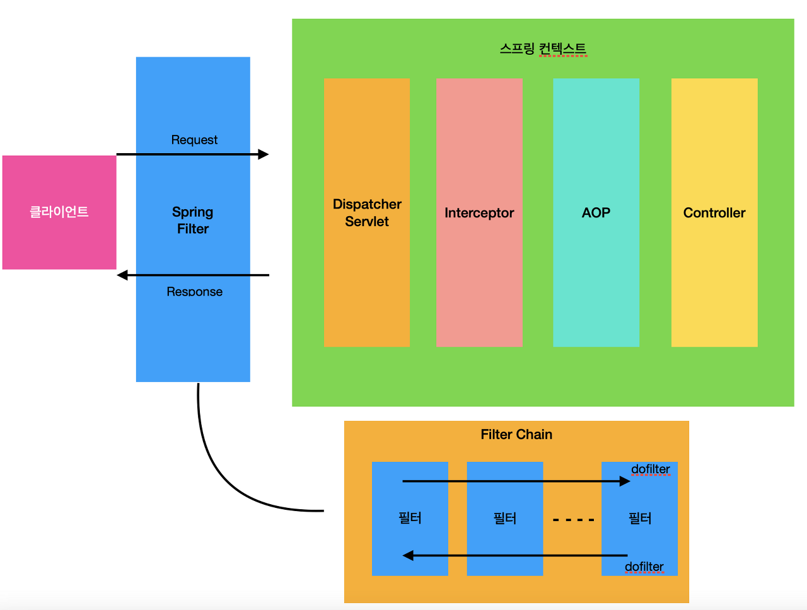
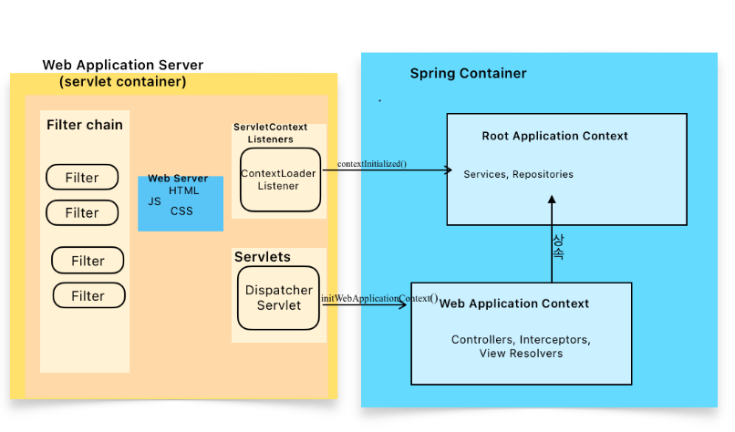

## 서론

시큐리티를 사용하지 않고 Jwt 기반의 인증을 개발하고 있었는데 문득 고민이 들었다.
항상 어떤 기술을 사용 하기 전에 다른 개발자들은 어떻게 구현을 했는지 찾아보는 습관이 있는데 찾아보니
대부분의 블로그들이 Jwt 토큰 검증을 필터 혹은 인터셉터에서 처리하고 있었다. 

사실 무슨 이유가 있는지 궁금하기도 했고 차이가 있다면 현재 내 상황에 맞는 방법으로 구현하고 싶었기 때문에 각 경우의 장단점을 알아보려고 한다.

## 필터와 인터셉터는 공통 관심사를 분리하기 위해 사용된다.

**공통 관심사는 비즈니스 로직으로부터 분리되어야한다.**
인증 및 인가 , 로깅,  인코딩 등 어플리케이션의 다양한 로직에 걸쳐 공통으로 적용되는 로직을 공통 관심사라고 한다.

간단히 말하면, 여러 곳에 중복되는 코드를 한 곳에서 관리 하게 해야한다는 말과도 같다.
그리고 그 일을 **필터**나 **인터셉터**가 처리하게 된다.

이렇게 함으로써 클래스가 단일 책임 원칙을 준수하게 되고, 변경이 필요할 경우 한 클래스만 수정하면 된다.
상황에 따라 공통 관심사를 분리하기 위해 필터나 인터셉터 중 하나를 사용할 수 있다. 특정 Url을 지정하지 않는 한 모든 요청은
필터와 인터셉터를 거치게 되지만, **필터와 인터셉터는 요청이 전달되는 순서와 접근할 수 있는 정보에서 차이가 난다.**

## 필터와 인터셉터의 차이

### ServletContext와 ApplicationContext의 이해

필터와 인터셉터는 서로 다른 컨텍스트에서 작동한다.
필터는 **서블릿 컨테이너 (톰캣)** 에 의해 관리되는 반면, 인터셉터는 **스프링 컨테이너**에 의해 관리된다.
이 차이는 접근할 수 있는 정보의 범위에 영향을 미친다. 서블릿 컨테이너는 스프링 컨테이너의 정보 즉, _**Root ApplicationContext**_ 와 _**Web ApplicationContext**_ 그리고 이들 컨텍스트에 의해 관리되는 빈들에 접근 할 수 없다.

한편, **DispatcherServlet**은 독특한 위치를 차지한다. 이 서블릿은 **스프링 빈으로서 스프링 컨테이너 내에서 관리되면서 동시에 서블릿 컨텍스트에 속한다.**
DispatcherServlet을 통해 서블릿 컨테이너와 스프링 컨테이너 사이의 연결이 이루어진다.

1. 웹 어플리케이션이 실행되면서 서블릿 컨테이너(예: Tomcat)가 활성화된다.
2. 서블릿 컨테이너는 어플리케이션에 선언된 어노테이션이나 web.xml을 통해 Filter, Listener등을 찾고 초기화한다.
3. **Root ApplicationContext 생성**: ContextLoaderListener의 contextInitialized() 메소드가 실행되어 Root ApplicationContext를 생성한다. Root ApplicationContext는 services, repositories와 같은 어플리케이션 전체에 걸쳐 공유되어야 하는 빈들을 생성하고 관리한다.
4. **DispatcherServlet 생성**: 서블릿 컨테이너가 DispatcherServlet을 생성한다.
5. **Web AplicationContext 생성**: DispatcherServlet이 초기화되면서 initWebApplicationContext() 메소드를 실행해 자체적인 Web ApplicationContext를 생성한다. 이때 Web ApplicationContext는 Root ApplicationContext를 상속하며, 주로 웹 관련 설정(컨트롤러, 뷰 리졸버) 빈을 생성하고 관리한다.

## Reference Blog
- https://kims-repo.tistory.com/45